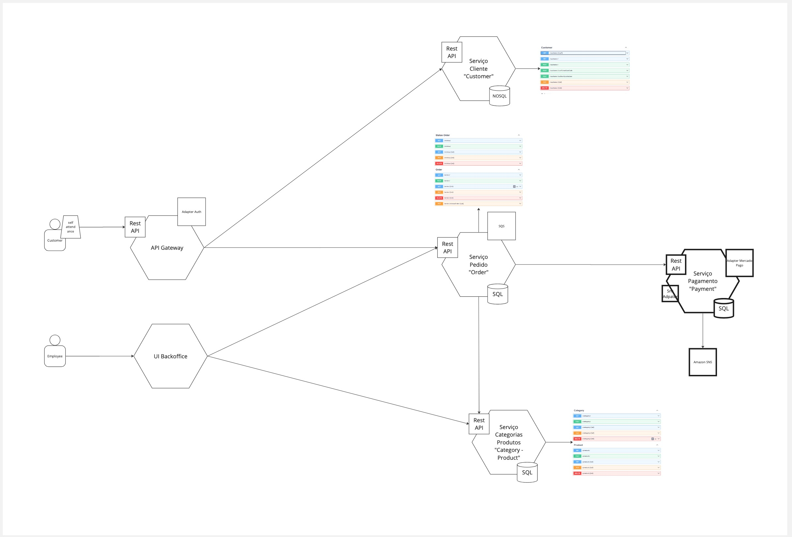
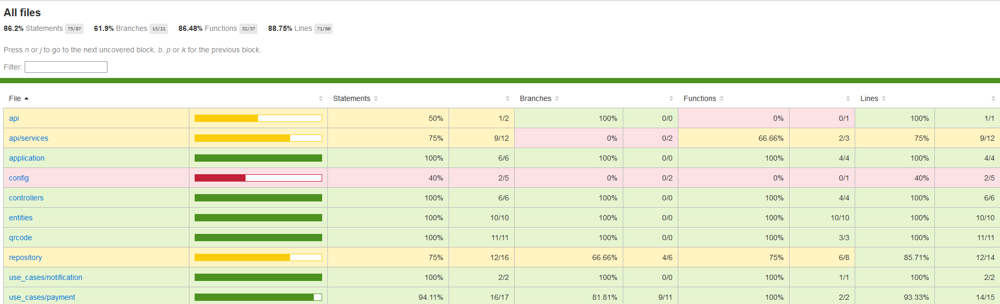

# PÓS-TECH SOAT3 TECH CHALLENGE

API Sistema de pedidos 'Totem de autoatendimento'

### Setup testes

Para rodar todos os testes localmente, você pode executar o comando
```bash
$ npm run test
```

Para rodar um teste específico, você pode executar o comando
```bash
$ npm run test <caminho-do-teste>
```
Para rodar o teste BDD
```bash
$ npm run bdd
```

## Tech challenge Fase 4

### Desenho da arquitetura



## Tech challenge Fase 5

### Desenho da arquitetura


Miro Documentação [Documentação](https://miro.com/app/board/uXjVNyWqWyk=/)

### Justificativa para o padrão SAGA 
-Foi utilizado o padrão Saga coreografado com ações compensatórias para realizar comunição entre os serviços de modo que seja possível 
trocar informações entre os serviços de maneira simples, eficaz e direta sem nenhuma dependência além das proprias filas para que ambos possam funcionar independentemente.
Em casos onde as notificações processadas não tenham o resultado esperado durante a execução das tarefas, ações compensatórias predefinidas são disparadas para notificar que
o evento não ocorreu para que se possa desfazer as alterações realizadas.

### Collection:

	Swagger UI: http://localhost/docs

### Guia completo com todas as instruções para execução do projeto e a ordem de execução das APIs, caso seja necessário.

#### API's:

Nosso banco de dados já está populado, no entanto, caso deseje criar novos registros, seguir a ordem indicada abaixo.

- Criar cliente
- Criar categoria
- Criar produto associado à categoria
- Criar pedido associado à cliente e produto

## Cobertura de teste evidências
 - Jest 


## Relatório Pre Owasp Zap
- Relatório Antes [Documentation]([https://github.com/3soat-software-architecture-pos-tech/g2-3soat-sa-app-category-product/blob/main/ZAP%20Scanning%20Report_14JUL2024.pdf](https://github.com/3soat-software-architecture-pos-tech/g2-3soat-sa-app-payments-microservice/blob/main/owaspzap/zapscanningbefore.pdf))
- Relatório Depois [Documentation]([https://github.com/3soat-software-architecture-pos-tech/g2-3soat-sa-app-category-product/blob/main/ZAP%20Scanning%20Report%20-%20Solved.pdf](https://github.com/3soat-software-architecture-pos-tech/g2-3soat-sa-app-payments-microservice/blob/main/owaspzap/zapscanningafter.pdf))

## Materias de Referência
- Alura: [Node js testes unitários e de integração](https://cursos.alura.com.br/course/nodejs-testes-unitarios-integracao)
- Alura: [Node js API Rest com Express e MongoDB](https://cursos.alura.com.br/course/nodejs-api-rest-express-mongodb)
- Alura: [O que é Behavior-Driven Development (BDD)](https://cursos.alura.com.br/extra/alura-mais/o-que-e-behavior-driven-development-bdd--c284)
- Jest: [Documentation](https://jestjs.io/)
- ESLint : [Documentation](https://pt-br.eslint.org/)
- Sonar Cloud: [Documentation](https://docs.sonarsource.com/sonarcloud/)

## Team
 - Turma: 3SOAT
 - Grupo: 2

   [André Felipe](andrefelipegodoi@gmail.com)
   
   [Bruna Carlota](brunacarlota@gmail.com)

   [Carlos Tofoli](henrique.tofoli@hotmail.com)

   [Guilherme Oliveira](guilherme.oliveira182@yahoo.com.br)

   [Valdeir Jesus](valdeir_014@hotmail.com)
